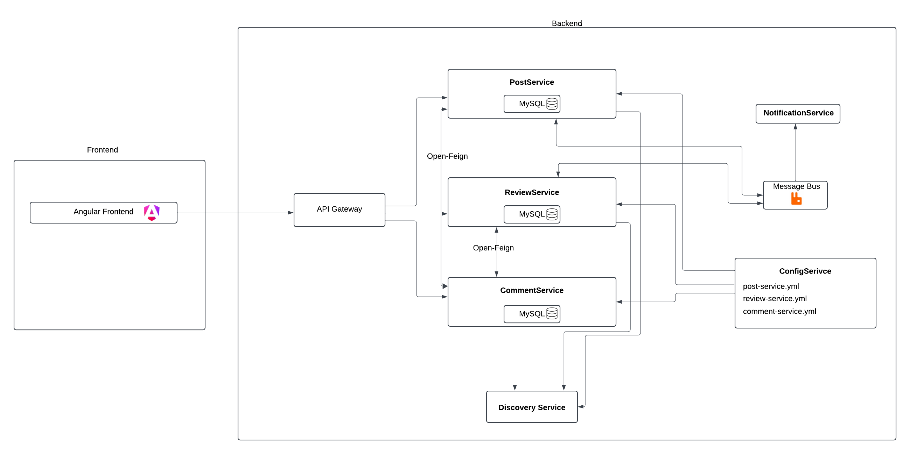

# Architecture

## Frontend:

- **Frontend (Angular)**: 
  De frontend wordt gemaakt met Angular, deze communiceert met de backend via de API Gateway en bevat een `AuthService` die de role en user bijhoudt.

## Backend:

- **API Gateway**: 
  De API Gateway werkt als de enige toegangspoort voor alle inkomende verzoeken van de frontend. Het is verantwoordelijk voor het routeren van verzoeken naar de juiste microservices.

- **Microservices**:
  - **PostService**: 
    Deze service beheert gegevens met betrekking tot posts en slaat deze op in een MySQL-database.
  - **ReviewService**: 
    Deze service handelt de review van posts af en slaat de gegevens op in een andere MySQL-database.
  - **CommentService**: 
    De CommentService beheert de reacties op posts, ook opgeslagen in een MySQL-database.

- **OpenFeign**: 
  Elke microservice maakt gebruik van OpenFeign voor synchrone communicatie met andere microservices. Er gebeurt synchrone communicatie tussen de ReviewService en CommentService aangezien er comments bij een afgewezen     
  review moeten staan zodat de redacteur weet welke wijzigingen hij moet toepassen. Ook is er synchrone communicatie tussen de PostService en CommentService zodat er direct comments bij een post gezet kunnen worden.

- **Discovery Service**: 
  De Discovery Service maakt gebruik van een service discovery patroon, waardoor microservices elkaar kunnen vinden. 
- **Config Service**: 
  De Config Service beheert configuratie-instellingen voor de verschillende microservices, zoals `post-service.yml`, `review-service.yml`, en `comment-service.yml`, waardoor de configuraties centraal kunnen worden beheerd.

- **Notification Service**: 
  De redacteur krijgt een melding wanneer een post goedgekeurd of afgekeurd is.

- **Message Bus**: 
  De Message Bus wordt gebruikt voor asynchrone communicatie tussen de verschillende microservices. Dit is in het geval van de PostService en ReviewService aangezien een post eerst nog moet goedgekeurd worden en dit kan     enige tijd duren, dus gebeurt dit asynchroon.

